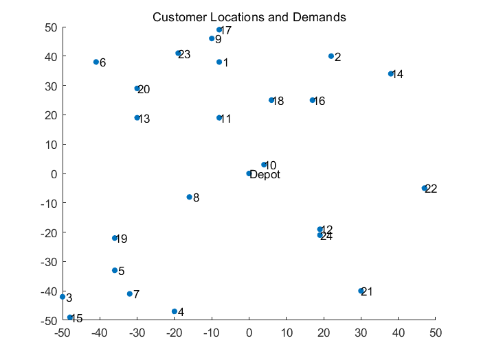
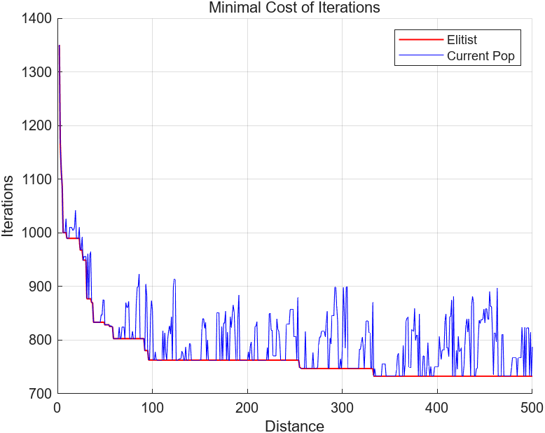
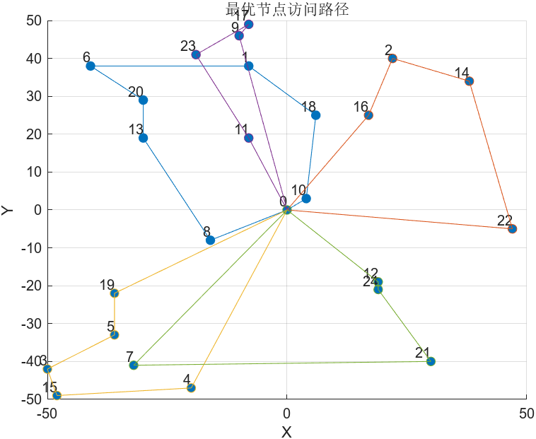

# 基于 MATLAB 通过遗传算法实现车辆路径优化问题求解

2024年5月的实验课作业，作业要求使用遗传算法解决任意的交通领域实践问题。

CVRP 问题，即包含容量限制的车辆路径优化问题（Capacity Vehicle Routing Problem），是物流和运输领域中的一个经典优化问题。其目标是确定一组车辆从一个配送中心出发，访问一系列客户节点并返回配送中心的 最优路径方案。该问题的目的是在满足所有客户需求和车辆运载能力限制的同时，最小化总行驶距离或总成本。该问题可以被认为是 TSP 问题的一种变体，即增加了车辆容量限制的 TSP 问题。TSP 问题也可以被理解为无容量限制的 VRP 问题，即一辆车走完全局最短路即可满足所有节点的需求。

本项目基于 MATLAB，通过构建一个遗传算法求解器对一个 CVRP 问题进行了求解。

## 文件说明

项目主目录下包含若干个 `.m` 文件，其中 `main.m` 是算例项目，求解器主体是函数文件 `GA_CVRP_optimize.m`。`image` 和 `data` 文件夹分别存放输出的图片和数据资料。此外，代码包含详细的注释信息，不提供额外的文档。

## 示例代码及算例

算例来自于 MATLAB 官网文章 [Capacitated Vehicle Routing Problem](https://www.mathworks.com/help/matlab/math/quantum-capacitated-vehicle-routing.html)，坐标点及各个顾客的需求量根据原文中的方法随机生成。算例可视化如下图所示，详情请参照原文。

> Capacitated vehicle routing is a combination of a knapsack problem and a traveling salesperson problem. The problem is for a vehicle (or set of vehicles) to visit a group of customers that are geographically distributed. The vehicle has a capacity constraint, where the capacity refers to a quantity that the vehicle delivers to each customer. The problem has a central depot, and the vehicle must return to the depot after each visit to a set of customers, or route. The problem is to visit the customers at minimal cost, where the cost is the total length of the route for visiting a group of customers.
> 
> The following figure shows four routes originating from a single point, the depot. These routes do not represent a minimal solution, because nodes 2 and 3 (at least) should be visited in the opposite order. The route containing nodes 2 and 3 has a self-intersection, which does not occur in an optimal tour.

算法使用顾客与仓库之间的 OD 矩阵，而不是真实坐标进行运算，保障了算法的兼容性和可拓展性。

## 算法设计简述

**基因编码设计：** 基因编码设计参考了博客 [用遗传算法解决VRP问题](https://blog.csdn.net/panbaoran913/article/details/128250015)，其基本逻辑为：首先随机生成所有顾客节点编号的随机排列，再在其中插入数量相当于运载工具数量减去 1 数量的 0，即，设此时共有 $K$ 辆车，则插入的 0 元素数量为 $K - 1$。每一段用 0 分割的节点序列即代表一辆车的访问节点次序。详情参见原文所述。

**约束处理：** 算法强调并实现了如下的模型约束：

- 每个客户节点必须被访问一次。
- 每辆车从配送中心出发并返回配送中心。
- 每辆车的总负载不能超过其最大载重量。

**适应度函数取值：** 取总路程倒数为适应度函数值。对于超出模型约束（车辆数量约束和总载重量限制约束）的个体，强制令其适应度函数值为 0。

**交叉和变异方法：** 使用单点交叉和单点变异的方法。**对于交叉、变异后产生不符合模型约束的非法个体的情形，不予交叉变异。** 该策略通过在交叉、变异前提前对交叉编译产生的个体进行检验并根据检验结果进行判断来实现。

**精英策略：** 算法保存历次迭代中取得的最优适应度个体，并在未来次数迭代中使用该个体替换种群中适应度最低的个体，避免种群劣化。

## 算法迭代过程

设置迭代次数为 1000 次，种群大小为 50000。由于交叉变异过程受到模型约束的限制，为了保障实际的交叉变异发生率，应当适当增加交叉变异概率。这里取得交叉变异概率分别为 $P_c = 0.9, P_m = 0.09$。

求解器支持在算法迭代过程中实时动态绘制下降过程，绘制结果如下图所示。

## 输出结果

算法的输出结果如下图所示，图中使用不同的颜色标记了不同车辆的访问路径。取得极小化路径长度为 815.29。

## 开源地址

本人已将代码基于 LGPL-3.0 许可证开源至 Gitee 平台，仓库地址为 [BOXonline_1396529/GA-CVRP-opt](https://gitee.com/BOXonline_1396529/GA-CVRP-opt)，可以在遵照许可证规范的前提下自行肆意修改取用。
