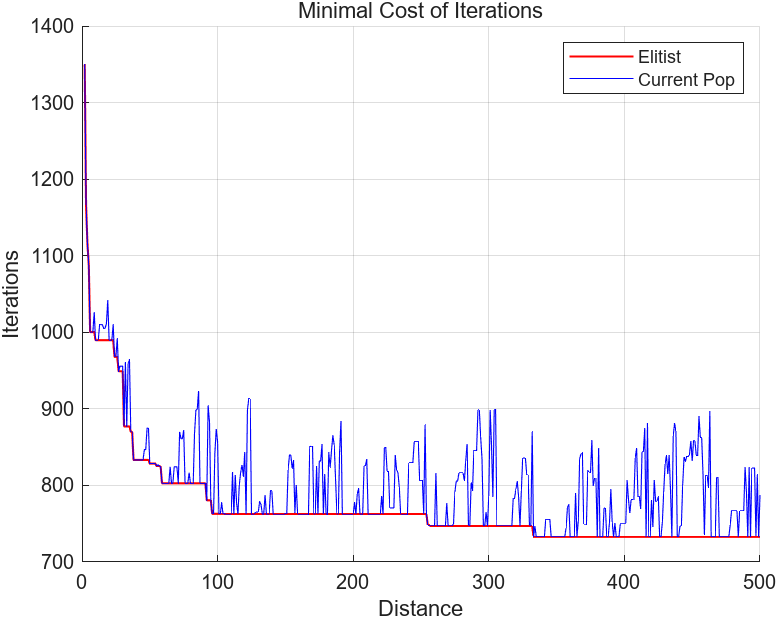

# Solving the Vehicle Routing Problem Using Genetic Algorithms in MATLAB

This is my May 2024 lab assignment, which required solving any practical problem in the transportation domain using a genetic algorithm.

The Capacitated Vehicle Routing Problem (CVRP) is a classic optimization problem in logistics and transportation. The objective is to determine the optimal routes for a fleet of vehicles that start from a depot, visit a series of customer nodes, and return to the depot. The aim is to minimize the total travel distance or cost while satisfying all customer demands and adhering to vehicle capacity constraints. This problem can be seen as a variant of the Traveling Salesman Problem (TSP), with the addition of vehicle capacity constraints. The TSP can also be understood as a VRP without capacity constraints, where a single vehicle must cover the entire shortest route to meet all node demands.

This project uses MATLAB to build a genetic algorithm solver to tackle a CVRP problem.

## File Description

The main directory contains several `.m` files, with `main.m` serving as the example project, and the main solver function located in `GA_CVRP_optimize.m`. The `image` and `data` folders store output images and data files, respectively. Detailed code comments are provided, so no additional documentation is included.

## Example Code and Cases

The example is based on a MATLAB article titled [Capacitated Vehicle Routing Problem](https://www.mathworks.com/help/matlab/math/quantum-capacitated-vehicle-routing.html). The coordinates and customer demands are randomly generated as per the method in the original article. A visualization of the example is shown below. For more details, please refer to the original article.

> Capacitated vehicle routing is a combination of a knapsack problem and a traveling salesperson problem. The problem is for a vehicle (or set of vehicles) to visit a group of customers that are geographically distributed. The vehicle has a capacity constraint, where the capacity refers to a quantity that the vehicle delivers to each customer. The problem has a central depot, and the vehicle must return to the depot after each visit to a set of customers, or route. The problem is to visit the customers at minimal cost, where the cost is the total length of the route for visiting a group of customers.
> 
> The following figure shows four routes originating from a single point, the depot. These routes do not represent a minimal solution, because nodes 2 and 3 (at least) should be visited in the opposite order. The route containing nodes 2 and 3 has a self-intersection, which does not occur in an optimal tour.

The algorithm uses the OD matrix between customers and the depot, rather than real coordinates, ensuring compatibility and scalability.

## Brief Algorithm Design

**Gene Encoding Design:** The gene encoding design is inspired by the blog post [Solving VRP Using Genetic Algorithm](https://blog.csdn.net/panbaoran913/article/details/128250015). The basic logic is: first, randomly generate a random permutation of all customer node numbers, and then insert zeros equal to the number of vehicles minus one. That is, if there are $K$ vehicles, insert $K - 1$ zeros. Each segment of nodes separated by zeros represents the visiting order for one vehicle. For more details, refer to the original post.

**Constraint Handling:** The algorithm emphasizes and implements the following model constraints:

- Each customer node must be visited exactly once.
- Each vehicle departs from and returns to the depot.
- The total load of each vehicle cannot exceed its maximum capacity.

**Fitness Function:** The inverse of the total distance is used as the fitness function. For individuals that violate model constraints (vehicle quantity and load capacity), their fitness value is forcibly set to 0.

**Crossover and Mutation:** Single-point crossover and mutation methods are used. **Crossover and mutation are not performed on individuals that do not meet model constraints.** This is achieved by checking the generated individuals before applying crossover or mutation and deciding based on the results.

**Elite Strategy:** The algorithm retains the best individual from each iteration and replaces the worst individual in the population in future iterations, preventing population degradation.

## Algorithm Iteration Process

The iteration count is set to 1000, and the population size is 50000. Due to model constraint restrictions during crossover and mutation, the actual crossover and mutation probabilities should be increased appropriately. Here, the crossover and mutation probabilities are set to $P_c = 0.9, P_m = 0.09$.

The solver supports real-time dynamic plotting of the minimization process during iterations. The results are shown in the figure below.

## Output Results

The algorithm's output is shown in the figure below, with different colors marking the routes of different vehicles. The minimal route length achieved is 732.00.

## Open Source Repository

I have released the code under the LGPL-3.0 license on the Gitee platform. The repository can be found at [BOXonline_1396529/GA-CVRP-opt](https://gitee.com/BOXonline_1396529/GA-CVRP-opt). You are free to modify and use the code according to the license terms.

Recently, the `roulette_wheel_selection` file was flagged as prohibited content by Gitee, making it inaccessible. This is due to the algorithm name being interpreted as referring to a "game of chance" in Chinese, leading to content censorship on the platform.

I have reported this issue to Gitee, but the issue itself was flagged due to the inclusion of the algorithm's name, making it also inaccessible. I am at a loss for words.

This issue cannot be resolved at the moment. I will upload future updates to GitHub. Please refer to the [corresponding GitHub repository](https://github.com/GitHubonline1396529/GA-CVRP-opt) for further access.
